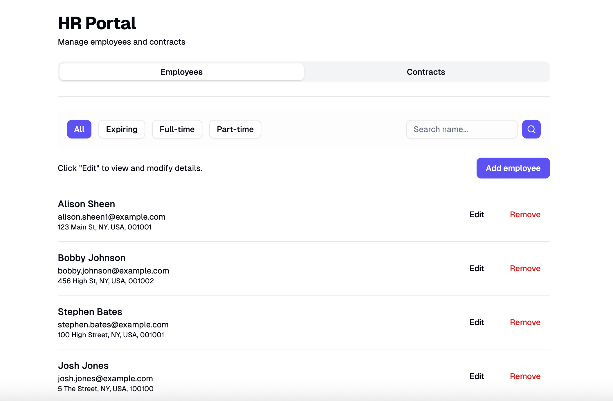

# HR Portal - API

A simple HR management system backend built with Scala and Play Framework. This RESTful API connects to the HR Portal frontend, providing employee and contract management. The React based frontend for this project can be found at the [frontend repository](https://github.com/sidendev/hr-portal-fe).

<div style="text-align: center;">
  
  <p style="font-style: italic;">HR Portal interface with employee management with filtering</p>
</div>

## Overview

The HR Portal API is a backend service that handles the business logic, data persistence with MySQL, and frontend integration points for the HR Portal application. Built with comprehensive test coverage, and error handling.

### Key Features

- **RESTful API** - Endpoints following REST principles
- **Comprehensive Testing** - Unit, integration, and end-to-end testing
- **Data Validation** - Data input validation
- **Error Handling** - Error responses with appropriate HTTP status codes
- **Database Migrations** - schema management with Play Evolutions
- **Containerisation** - Docker support for local development and deployment - to be implemented

## Technology Stack

### Core Framework
- **Scala 2.13** - Type-safe, functional programming
- **Play Framework 2.8** - Web framework
- **Slick 3.3** - Database access library with type-safe queries
- **MySQL 8.0** - Production database (H2 in-memory for testing)
- **sbt** - Build tool

### Testing
- **ScalaTest** - Primary testing framework
- **Mockito** - Mocking for unit tests
- **Play Specs2** - Integration testing
- **Selenium** - End-to-end browser testing
- **sbt-scoverage** - Code coverage reporting - to be implemented

## Project Structure

```
app/
├── controllers/        # API endpoints and request handling
│   ├── EmployeesController.scala
│   ├── ContractsController.scala
│   └── HomeController.scala
├── dtos/              # Data Transfer Objects
│   ├── CreateEmployeeDto.scala
│   ├── CreateContractDto.scala
│   ├── UpdateEmployeeDto.scala
│   ├── UpdateContractDto.scala
│   ├── ContractResponseDto.scala
│   └── EmployeeResponseDto.scala
├── models/            # Domain models
│   ├── EmployeesModel.scala
│   ├── ContractsModel.scala
│   ├── EmailsModel.scala
│   └── Tables.scala
├── repositories/      # Data access layer
│   ├── EmployeesRepository.scala
│   ├── ContractsRepository.scala
│   └── EmailsRepository.scala
└── services/          # Business logic
    ├── EmployeesService.scala
    ├── ContractsService.scala
    └── EmailsService.scala

test/
├── controllers/       # Controller tests
│   ├── EmployeesControllerSpec.scala
│   ├── ContractsControllerSpec.scala
│   └── HomeControllerSpec.scala
├── services/          # Service layer tests
│   ├── EmployeesServiceSpec.scala
│   ├── ContractsServiceSpec.scala
│   └── EmailsServiceSpec.scala
├── e2e/               # End-to-end tests
│   ├── EndToEnd.scala
│   └── EndToEndHelpers.scala
└── resources/
    └── test-schema.sql
```

## Testing Strategy

### 1. Unit Tests
- **Purpose**: Test individual components with mocked dependencies
- **Coverage**: Business logic, validation, and data transformation
- **Location**: `test/services/`
- **Key Tests**:
  - Employee creation with valid/invalid data
  - Contract validation rules
  - Email generation and unique email rotation logic

### 2. Integration Tests
- **Purpose**: Test component interactions with database
- **Coverage**: Service and Controller layers
- **Location**: `test/controllers/`
- **Key Tests**:
  - CRUD operations for Employees and Contracts
  - Input validation and error handling

### 3. End-to-End Tests
- **Purpose**: Test complete workflows from API frontend to database
- **Coverage**: Full stack testing with Selenium
- **Location**: `test/e2e/`
- **Key Tests**:
  - Complete user workflows
  - Input validation and error handling

## Database

The application uses **MySQL 8.0** in production with **H2 in-memory database** for testing. The database schema includes the following tables with their relationships:

### Employees Table
Stores employee personal information and links to their email records.

```sql
CREATE TABLE employees (
  id INT PRIMARY KEY AUTO_INCREMENT,
  first_name VARCHAR(255) NOT NULL,
  last_name VARCHAR(255) NOT NULL,
  email VARCHAR(255) UNIQUE NOT NULL,
  mobile_number VARCHAR(20) NOT NULL,
  address VARCHAR(255),
  email_id BIGINT NULL,
  INDEX ix_employees_email_id (email_id),
  CONSTRAINT fk_employees_email
    FOREIGN KEY (email_id) REFERENCES emails(id)
    ON DELETE SET NULL
);
```

### Emails Table
Manages email addresses for employees, supporting unique email rotation and history.

```sql
CREATE TABLE emails (
  id BIGINT NOT NULL AUTO_INCREMENT,
  employee_id INT NULL,
  address VARCHAR(255) NOT NULL,
  is_active BOOLEAN NOT NULL DEFAULT TRUE,
  created_at TIMESTAMP NOT NULL DEFAULT CURRENT_TIMESTAMP,
  deactivated_at TIMESTAMP NULL,
  PRIMARY KEY (id),
  UNIQUE KEY ux_emails_address (address),
  INDEX ix_emails_employee_id (employee_id),
  CONSTRAINT fk_emails_employee
    FOREIGN KEY (employee_id) REFERENCES employees(id)
    ON DELETE SET NULL
);
```

### Contracts Table
Stores employment contract details for each employee.

```sql
CREATE TABLE contracts (
  id INT PRIMARY KEY AUTO_INCREMENT,
  employee_id INT NOT NULL,
  contract_type ENUM('Permanent', 'Contract') NOT NULL,
  start_date DATE NOT NULL,
  end_date DATE,
  full_time BOOLEAN NOT NULL DEFAULT true,
  hours_per_week INT,
  FOREIGN KEY (employee_id) REFERENCES employees(id) ON DELETE CASCADE
);
```

### Key Relationships
1. **Employees to Emails**: One-to-many (one employee can have multiple email records, only one active)
2. **Employees to Contracts**: One-to-many (one employee can have multiple contracts over time)
3. **Email to Employee**: Optional many-to-one (email must be linked to an employee - only one active at any time)

## Getting Started

### Prerequisites

- **Java 11** or higher
- **sbt** (Scala Build Tool) 1.5.0 or higher
- **Docker** (optional, for containerised deployment) - docker not yet implemented

### Installation

1. **Clone the repository**
   ```bash
   git clone https://github.com/sidendev/hr-portal.git
   cd hr-portal
   ```

2. **Run the application**
   ```bash
   # Start the development server
   sbt run
   ```
   The API should be available at `http://localhost:9000`

3. **Run tests**
   ```bash
   # Run all tests
   sbt test
   
   # Run specific test suite
   sbt "testOnly controllers.EmployeesControllerSpec"

   ```

### Configuration

Create a `.env` file in the root directory with your database configuration:

```bash
# Database Configuration
DB_USER=root
DB_PASSWORD=your-db-password
DB_NAME=your-db-name
DB_URL=jdbc:mysql://localhost:3306/your-db-name
```

### Application Configuration

The main configuration is in `conf/application.conf` and uses the environment variables above. No changes are needed to this file for local development.

### CORS Configuration

The application has CORS (Cross-Origin Resource Sharing) enabled by default with the following configuration in `application.conf`:

- **Allowed Origins**: `http://localhost:5173` (Vite default development server)
- **Allowed Methods**: GET, POST, PUT, PATCH, DELETE, OPTIONS
- **Allowed Headers**: Accept, Origin, Content-Type, X-Requested-With, Authorization
- **Credentials**: Not allowed (set to `false`)
- **Preflight Cache**: 3 days

To modify CORS settings (e.g., to add additional origins), update the `application.conf` file.

### Test Configuration

Tests use an in-memory H2 database with the following configuration (already set up in `conf/application.test.conf`).
No additional configuration is needed to run tests.

## API Endpoints

### Employees

- `GET    /employees` - List all employees (supports filtering)
- `POST   /employees` - Create a new employee
- `GET    /employees/:id` - Get employee by ID
- `PATCH  /employees/:id` - Update employee
- `DELETE /employees/:id` - Delete employee

#### Query Parameters for Employees

| Parameter    | Type    | Description                                      | Example                     |
|--------------|---------|--------------------------------------------------|-----------------------------|
| q            | String  | Search query (name)                              | `?q=john`                   |
| contractType | String  | Filter by contract type (full-time/part-time)    | `?contractType=full-time`   |
| expiring     | String  | Show contracts expiring this month               | `?expiring=current-month`   |
| page         | Integer | Page number (1-based)                            | `?page=2`                   |
| size         | Integer | Items per page (max 100)                         | `?size=10`                  |

### Contracts

- `GET    /contracts` - List all contracts
- `POST   /contracts` - Create a new contract
- `GET    /contracts/:id` - Get contract by ID
- `PATCH  /contracts/:id` - Update contract
- `DELETE /contracts/:id` - Delete contract

## Testing

### Test Database Setup

The test environment uses an H2 in-memory database with a test db schema file located in the test resources.

### Test Coverage

- **Unit Tests**: Test individual service methods
- **Integration Tests**: Test controller endpoints with database
- **E2E Tests**: Full workflow testing with Selenium

## Deployment

### Docker

Docker deployment details to be added here after deployment.

### Production Configuration

Production config details to be added here after deployment.
